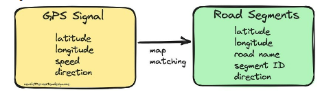
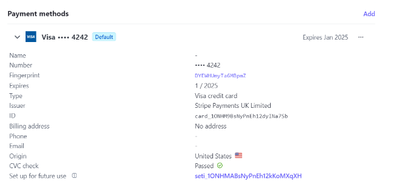

1. ***Design the system components of a drive-sharing application (ex: Uber, Lyft). Specify what elements are necessary for this application to work.***

In your design, you must provide a list of the data that you need to collect for the operation of the application. For each, provide a description of why you need this data. Examples:

**Who are the users of your application? What kind of information do you need from each of them?**

**Passengers:**

**Personal Information:** Name, contact number, email address, and profile picture.

**Payment Information:** Credit card details, digital wallet information, or other preferred payment methods.

**Location Data:** Real-time location to enable the driver to reach the pickup location.

Ride Preferences: Such as car type, special requests, or specific requirements.

**Drivers:**

**Personal Information:** Name, contact number, email address, and profile picture.

**Vehicle Information:** Make, model, color, license plate number, and insurance details.

**Location Data:** Real-time location to match with nearby ride requests.

**Bank/Payment Information:** Necessary for payment transfers from the platform to the driver's account.

**Identity Verification:** Driver's license, proof of insurance, and other documents to verify the driver's identity and eligibility.

**Availability Status:** To indicate whether the driver is currently available or not.

- **What data do you need to make the user experience better? Examples: better ride experience, shorter wait time, faster routes, etc**

**User Preferences:**

- **Ride Preferences:** Information on the type of vehicle (e.g., standard, premium), music preferences, and temperature settings.
- Route Preferences: Preferred routes or favorite locations saved by the user.

**Historical Ride Data:**

- **Ride History:** Details of past rides, including routes taken, travel times, and user ratings.
- **Frequent Destinations:** Analysis of frequently visited locations to suggest shortcuts or preferred routes.
- Recommend similar trips, rebook trip.

**Calculate Expected Time of Arrival (ETA)**

- **Eyeball:** when the rider enters a destination in the app.
- **Dispatch:** to find a car to pick up the rider in the shortest waiting time
- **Pick up:** to find the time needed to pick up the rider.
- **On-trip:** to provide live updates on time to reach the destination.

**Real-Time Traffic and Weather Data:**

- **Traffic Conditions**: Real-time traffic updates to optimize routes and estimate accurate arrival times. (Weather, time of the day, vehicles in the road)
- **Weather Conditions:** Consideration of weather conditions for better route planning and user safety.

**Machine Learning Predictions:**

- **Calculate pricing by demand:** Depending on how many riders request from a certain location.
- **Demand Prediction:** Analyzing historical data to predict peak hours and areas with high demand for rides.
- **Route Prediction:** Utilizing machine learning to predict optimal routes based on traffic patterns and historical data.

**Location-Based Services:**

- **Geofencing:** Using geofencing to provide location-specific promotions, discounts, or alerts.
- **Location-Based Recommendations:** Offering suggestions for nearby restaurants, attractions, or services.
- **Current location every 30sec**

  

**User Feedback and Ratings:**

- **Feedback Analysis**: Analyzing user comments and ratings to identify areas for improvement or address specific user concerns.
- **Driver Performance Metrics:** Evaluating driver ratings and feedback to ensure high-quality service.

**Predictive Analytics:**

- **Wait Time Predictions:** Predicting wait times based on historical data and current demand to set user expectations.
- **Dynamic Pricing:** Adjusting pricing based on demand, time of day, and other relevant factors.

**User Engagement Data:**

- **App Usage Patterns:** Analyzing how users interact with the app to identify features that are popular or underutilized.
- **Push Notification Effectiveness:** Evaluating the impact of push notifications on user engagement and conversion rates.

**Customer Support Interactions:**

- **User Support Data:** Analyzing user interactions with customer support to identify recurring issues and improve the resolution process.

**In-App Surveys and Feedback:**

- **User Surveys:** Collecting feedback through in-app surveys to understand user preferences and pain points.
- **Feature Requests: I**dentifying features users would like to see in future updates.

**In case of Emergency**

- Call emergency services
- Your name, cellphone number
- Car’s make, model, color, license plate, and live location automatically available to **dispatchers**

**Terms of agreement:** 

Make sure you keep a record of your customer’s written agreement to these terms.

**Stripe Compliance:**

You’re responsible for your compliance with all applicable laws, regulations, and network rules when saving a customer’s payment details. For instance, if you want to save their payment method for future use, such as charging them when they’re not actively using your website or app. Add terms to your website or app that state how you plan to save payment method details and allow customers to opt in. If you want to charge them when they’re offline, make sure your terms include the following:

- The customer’s agreement to your initiating a payment or a series of payments on their behalf for specified transactions.
- The anticipated timing and frequency of payments (for example, if the charges are for scheduled installments, subscription payments, or unscheduled top-ups).
- How you determine the payment amount.
- Your cancellation policy, if the payment method is for a subscription service.

**What kind of data do you need to collect to measure the performance and efficiency of the application?** 

**User Metrics:**

1. **User Registration and Retention:** Number of new user registrations and the percentage of retained users over time.
1. **User Engagement:** Metrics related to user activity within the app, such as the frequency of rides, time spent in the app, and feature usage.

**Ride Metrics:**

1. **Ride Completion Rate:** Percentage of successfully completed rides compared to the total number of ride requests.
1. **Cancellation Rate:** Percentage of ride requests that are canceled by either passengers or drivers.
1. **Average Ride Duration and Distance:** To understand the typical length and distance of rides.

**Efficiency Metrics:**

1. **Matching Time:** Time taken to match a passenger with an available driver.
1. **Wait Time:** Time elapsed between a ride request and the arrival of the driver.
1. **Idle Time:** Time during which drivers are available but not actively engaged in a ride.

**Geospatial Metrics:**

1. **Route Efficiency:** Comparison of actual routes taken with optimal routes to identify inefficiencies.
1. **Coverage Analysis:** Evaluation of service coverage in different geographic areas.

**Financial Metrics:**

1. **Revenue and Earnings:** Total revenue generated by the platform and earnings for drivers.
1. **Transaction Success Rate:** Percentage of successful financial transactions for rides.
1. **Pricing Metrics:** Analysis of dynamic pricing effectiveness and user response.

**Customer Satisfaction Metrics:**

1. **User Ratings and Feedback:** Aggregated user ratings and qualitative feedback to assess overall satisfaction.
1. **Resolution Time for Support Issues:** Time taken to resolve customer support queries or issues.

**Performance and Stability Metrics:**

1. **App Load Time:** Time taken for the app to load and become functional.
1. **App Crashes and Errors:** Frequency of crashes or errors, and the time taken to address and resolve issues.

**Driver Metrics:**

1. **Driver Acceptance Rate:** Percentage of ride requests accepted by drivers.
1. **Driver Ratings and Feedback:** Aggregated ratings and feedback to monitor driver performance.
1. **Driver Utilization:** Analysis of how frequently drivers are actively engaged in providing rides.

**Operational Metrics:**

1. **Server Response Time:** Time taken for the server to respond to user requests.
1. **System Downtime:** Amount of time the platform is unavailable for users.

**Market Metrics:**

1. **Market Share:** The platform's share of the ride-sharing market.
1. **Competitor Analysis:** Comparative analysis with other ride-sharing services.

**What about payment and tipping?**

Credit Card information:

- Charge a customer an order and store the details for future purchases.
- Initiate the first payment of a series of recurring payments.
- Charge a deposit and store the details to charge the full amount later.

- Temporary authorization holds on the rider cards for the approximate amount of the estimated fare.
- Once completed, the card is charged the final fare.
- **We will use Stripe** as the main payment system. Stripe is certified to PCI Service Provider Level 1. This is the most stringent level of certification available in the payments industry.

**Payment Data:**

1. **Transaction History:** Detailed records of each financial transaction, including ride fares, tips, and any additional fees.
1. **Payment Methods:** Information about the payment methods used by passengers (credit cards, digital wallets, etc.).
1. **Transaction Success Rates:** Percentage of successful payment transactions compared to the total number of transactions.

**Pricing and Revenue Data:**

1. **Dynamic Pricing:** Data on when and how often dynamic pricing (surge pricing) is applied.
1. **Revenue per Ride:** Average revenue generated from each ride, factoring in the platform's commission.
1. **Promotional Discounts:** Data on the usage and impact of promotional discounts or coupons on payments.

**User Billing Information:**

1. **Billing Address:** For verification purposes and compliance with financial regulations.
1. **Receipts:** Generating and storing electronic receipts for each transaction, providing a detailed breakdown of charges.

**Tipping Data:**

1. **Tipping Frequency:** The percentage of rides where passengers provide tips.
1. **Average Tip Amount:** Calculating the average tip amount given by passengers.
1. **In-App Tipping Feature Usage:** Monitoring the usage of the in-app tipping feature.

**Payment Processing Metrics:**

1. **Transaction Processing Time:** Time taken for payment transactions to be processed and reflected in both the passenger and driver accounts.
1. **Payment Gateway Performance:** Monitoring the reliability and efficiency of the payment gateway services.

**Fraud Prevention:**

1. **Fraud Detection Metrics:** Identifying and tracking potentially fraudulent activities in payment transactions.
1. **Security Logs:** Maintaining logs of security-related events to ensure the safety of payment data.

**Driver Payouts:**

1. **Earnings Breakdown:** Providing drivers with detailed information on their earnings, including the fare, tips, and any bonuses.
1. **Payout Processing Time:** Time taken for earnings to be transferred from the platform to the driver's account.

**Analysis of Payment-related Issues:**

1. **Payment Disputes:** Monitoring and resolving disputes related to payments.
1. **Refund Requests:** Tracking the frequency and reasons for refund requests and processing times.

**User Feedback on Payments:**

1. **Feedback on Payment Process:** Gathering user feedback on the payment process to identify pain points and areas for improvement.

**Regulatory Compliance:**

1. **Compliance Data:** Ensuring compliance with local and international financial regulations related to payment processing and data security.

Tokenization transforms sensitive payment data into a non-sensitive equivalent, which can be stored and transmitted safely without exposing the original data to potential security threats.

- Data collection: When a customer initiates a transaction, they provide their payment information, such as their credit card details to the business.
- Tokenization request: Depending on how the business's payment system is set up, they may send the sensitive data to a secure tokenization service, typically provided by a payment processor or a third-party tokenization vendor. If the business is using tokenization-enabled payment hardware or software such as Stripe Terminal, tokenization happens automatically as a basic part of payment processing.
- Token generation: The tokenization process uses a combination of algorithms, encryption methods and secure storage to generate a unique token that represents the original payment data. This token is typically a random string of characters or numbers that has no inherent value or meaning outside of the specific payment system.

- Token storage: The token is stored in the business's system, replacing the sensitive payment data. The original payment data is stored securely in the tokenization service's secure vault, which is designed to protect it against unauthorized access and data breaches.
- Token usage: When the business needs to process the transaction, they can send the token to the payment processor or tokenization service. The service then maps the token back to the original payment data securely, allowing the transaction to be completed without exposing the sensitive information to the business or other intermediaries.
- Token reusability: For recurring transactions, such as subscriptions or stored customer profiles, the same token can be used multiple times without collecting sensitive payment data again. This simplifies the payment process while maintaining security.

(This is how you see a customer’s credit card info in stripe)

**- Include a privacy design for the application.** 

**- For all the data that is being collected, what can be seen and by whom?** 

**- What information should have restricted access?** 

**- what information should not be seen by anyone?**

**User Information:**

1. **Who Can See:**
   1. **Users themselves:** Access to their own profile and ride history.
   1. **Customer Support:** Limited access to user information for issue resolution.
1. **Restricted Access:**
   1. **Other Users:** User profiles and personal information should not be accessible to other users.

**Location Data:**

1. **Who Can See:**
   1. **Drivers:** Access to the real-time location of passengers for ride coordination.
   1. **Passengers:** Access to the real-time location of the assigned driver.
   1. **Customer Support:** Limited access for resolving location-related issues.
1. **Restricted Access:**
   1. **Unauthorized Employees:** Location data should not be accessible to employees without a legitimate need.

**Financial Data:**

1. **Who Can See:**
   1. **Passenger:** Access to their own transaction history and receipts.
   1. **Driver:** Access to their earnings, transaction details, and payout history.
   1. **Financial Team:** Limited access for processing payments.
1. **Restricted Access:**
   1. **Other Users:** Financial data should not be accessible to other users.
   1. **Unauthorized Employees:** Strictly limit access to financial data to authorized personnel only.

**User Feedback and Ratings:**

1. **Who Can See:**
   1. **Passenger and Driver:** Access to their own feedback and ratings.
   1. **Customer Support:** Access for issue resolution and quality assurance.
1. **Restricted Access:**
   1. **Other Users:** Feedback and ratings should not be accessible to other users.

**Driver Documentation:**

1. **Who Can See:**
   1. **Drivers:** Access to their own documentation (e.g., license, insurance).
   1. **Verification Team:** Access for verifying and approving driver documentation.
1. **Restricted Access:**
   1. **Passengers:** Driver documentation should not be accessible to passengers.
   1. **Other Users:** Restricted access to unauthorized employees.

**Admin and Support Tools:**

1. **Who Can See:**
   1. **Administrators:** Access to all data for system management and oversight.
   1. **Customer Support:** Access to user data for issue resolution.
1. **Restricted Access:**
   1. **Unauthorized Employees:** Limit access to sensitive user data to only those who require it for their roles.

**Security Logs and Audit Trails:**

1. **Who Can See:**
   1. **Security and IT Teams:** Access to logs for monitoring and security investigations.
   1. **Administrators:** Access for system oversight and audit purposes.
1. **Restricted Access:**
   1. **Unauthorized Employees:** Limit access to security logs to those involved in security and IT roles.

**Emergency Features (e.g., SOS Button):**

1. **Who Can See:**
   1. **Emergency Services:** Access to relevant emergency information.
   1. **Customer Support:** Limited access for handling emergency situations.
1. **Restricted Access:**
   1. **Other Users:** Emergency information should not be accessible to other users.

**Legal and Compliance Records:**

1. **Who Can See:**
   1. **Legal and Compliance Teams:** Access for compliance purposes.
   1. **Administrators:** Access for legal and regulatory oversight.
1. **Restricted Access:**
   1. **Unauthorized Employees:** Limit access to legal and compliance records to those involved in these roles.

**Data Related to Regulatory Compliance:**

1. **Who Can See:**
   1. **Compliance Team:** Access for ensuring adherence to privacy regulations.
   1. **Legal Team:** Access for legal compliance.
1. **Restricted Access:**
   1. **Unauthorized Employees:** Limit access to data related to regulatory compliance to authorized personnel only.

**Assume you are a pen-tester, and you are in charge of testing the privacy design proposed.**

- What are the risks if you are able to get access to the app as a user, as an admin, and as developer?

1. **Access as a User:**
   1. **Risk:** If an attacker gains unauthorized access as a user, they may have access to personal information, location data, and transaction history.
   1. **Potential Privacy Breaches:**
      1. Unauthorized access to the user's ride history, including pickup/drop-off locations and timestamps.
      1. Exposure of personally identifiable information (PII) such as name, contact details, and billing information.
1. **Access as an Admin:**
   1. **Risk:** Unauthorized access as an admin poses a significant threat as it could lead to the exposure of a large volume of user data and compromise the integrity of the system.
   1. **Potential Privacy Breaches:**
      1. Access to comprehensive user profiles, including financial data, ride history, and location information.
      1. Manipulation or unauthorized modification of user data.
      1. Unauthorized access to sensitive system logs containing security-related information.
1. **Access as a Developer:**
   1. **Risk:** Unauthorized access as a developer could lead to the exposure of sensitive code, API keys, and potentially result in malicious modifications to the application.
   1. **Potential Privacy Breaches:**
      1. Exposure of source code, which may reveal security vulnerabilities or sensitive algorithms.
      1. Unauthorized access to development databases containing test user data or other sensitive information.
      1. Injection of malicious code into the application, compromising user data integrity.

- In any of these cases, what are the ways that an attacker can provoke a privacy breach? What kind of attacks can be used to accomplish this.

1. **Access as a User:**
   1. **Attack Scenarios:**
      1. Session Hijacking: Exploiting session vulnerabilities to take control of a legitimate user's session.
      1. Credential Stuffing: Using leaked credentials from other sources to gain unauthorized access.
   1. **Privacy Breach Impact:**
      1. Unauthorized viewing of user-specific data, leading to potential identity theft or harassment.
      1. Exposure of user location data may compromise personal safety.
1. **Access as an Admin:**
   1. **Attack Scenarios:**
      1. Brute Force Attacks: Attempting to guess admin credentials through automated trial-and-error.
      1. Exploiting Weak Access Controls: Manipulating access control mechanisms to escalate privileges.
   1. **Privacy Breach Impact:**
      1. Comprehensive exposure of user data, leading to severe privacy violations.
      1. Potential manipulation of user data, eroding user trust and confidence in the platform.
1. **Access as a Developer:**
   1. **Attack Scenarios:**
      1. Code Injection: Exploiting vulnerabilities to inject malicious code into the application.
      1. Unauthorized API Access: Gaining access to sensitive APIs or endpoints.
   1. **Privacy Breach Impact:**
      1. Exposure of sensitive application logic, leading to potential exploitation of vulnerabilities.
      1. Unauthorized access to development databases, risking exposure of test user data.

- Write an ethical analysis of the consequences of a privacy breach of the app for each of the cases above. 

1. **Access as a User:**
   1. **Consequences of Privacy Breach:**
      1. Loss of user trust in the platform.
      1. Potential financial losses due to unauthorized access to billing information.
   1. **Ethical Considerations:**
      1. Violation of user privacy is ethically unacceptable and may result in legal consequences for the service provider.
1. **Access as an Admin:**
   1. **Consequences of Privacy Breach:**
      1. Severe erosion of user trust and potential legal repercussions.
      1. Financial losses for affected users due to unauthorized access to financial data.
   1. **Ethical Considerations:**
      1. Admins have a higher responsibility to protect user data, making any breach a severe ethical violation.
1. **Access as a Developer:**
   1. **Consequences of Privacy Breach:**
      1. Exposure of sensitive algorithms may impact the competitiveness of the service.
      1. Compromise of test user data may lead to ethical concerns regarding user consent for testing.
   1. **Ethical Considerations:**
      1. Developers must uphold the principles of confidentiality and integrity, and unauthorized access or manipulation of data is ethically unacceptable.

***2. Your drive sharing company has decided to sell users data to advertisers.*** 

You have been asked to loosen up your design so that data can be sold to advertisers. Additionally, your manager has asked you to provide a list of data that can be sold, so the advertisers can maximize the accuracy of the ads.

- Provide the details of the new privacy design following the same principles you used for the original design.

Based on the original design, some things should be considered like:

1. **Data Anonymization:**
   1. Instead of selling raw user data, data should be anonymized and aggregated to ensure the privacy of individual users.
   1. Also, strengthen security measures to protect any data that is shared, ensuring that it is not vulnerable to unauthorized access or breaches.
   1. All the security logs and audit trails, personal information, as well as the financial data, should not be sold to the advertisers, or they shouldn't have access to it. Also, location data shouldn't be linked to any specific user.
      1. In case of any security breach, this data should be encrypted and should not be easily linked to any user. 
1. **Opt-In System:**
   1. Implement an opt-in system where users can choose to participate in targeted advertising. This ensures that users have control over their data and are aware of its use.
   1. Provide users with tools and controls to manage their privacy settings. Allow them to easily opt-out of data sharing if they choose to do so, reinforcing their sense of control over their personal information.
   1. Maintain transparent communication with users about the advertising model, ensuring that they are informed about data usage.
1. **Minimal Data Collection:**
   1. Limit the collection of user data to what is strictly necessary for the core functionality of the drive-sharing service. Avoid collecting unnecessary information that could be potentially sold to advertisers.

**User Information:**

1. **Who Can See:**
   1. **Users themselves:** Access to their own profile and ride history.
   1. **Customer Support:** Limited access to user information for issue resolution.
   1. **Advertisers (If opted for):** Limited access to anonymous demographic data.
1. **Restricted Access:**
   1. **Other Users:** User profiles and personal information should not be accessible to other users.

**Location Data:**

1. **Who Can See:**
   1. **Drivers:** Access to the real-time location of passengers for ride coordination.
   1. **Passengers:** Access to the real-time location of the assigned driver.
   1. **Customer Support:** Limited access for resolving location-related issues.
   1. **Advertisers (If opted for):** Limited access to visited locations (Home and other personal locations specified by the user will not be collected)
1. **Restricted Access:**
   1. **Unauthorized Employees:** Location data should not be accessible to employees without a legitimate need.

**The rest of the privacy design will remain the same.**

- Repeat the pen-tester exercise done for the original design. 

1. **Risks and Potential Privacy Breaches:**
- **User Access:**
  - **Risk:** Unauthorized users gaining access to personal profiles, ride history, and other sensitive information.
  - **Possible Attacks:** Credential stuffing, brute force attacks, or exploiting vulnerabilities in the app's authentication system.
  - **Ethical Consequences:** Violation of user privacy, potential misuse of personal information, loss of trust, and reputational damage.
- **Admin Access:**
  - **Risk:** Unauthorized access to sensitive user data, financial records, and security logs.
  - **Possible Attacks:** Exploiting vulnerabilities in admin interfaces, social engineering attacks, or unauthorized access to admin credentials.
  - **Ethical Consequences:** Breach of user confidentiality, misuse of financial data, and potential legal repercussions, leading to severe damage to the company's reputation.loc
- **Developer Access:**
  - **Risk:** Unauthorized access to the app's source code, potentially exposing vulnerabilities that could be exploited.
  - **Possible Attacks:** Exploiting weak development practices, injecting malicious code, or taking advantage of insecure API endpoints.
  - **Ethical Consequences:** Breach of intellectual property, potential manipulation of the app's functionality, and compromising user privacy, leading to trust erosion.

1. **Ethical Analysis of Privacy Breach Consequences:**
- **User Access:**
  - Breaching user privacy is a violation of trust and ethical standards. Users entrust the platform with their personal information, and unauthorized access undermines this trust. The consequences include emotional distress for affected users and potential harm if their data is misused.
- **Admin Access:**
  - Unauthorized access to admin accounts poses severe ethical concerns, as it can lead to the misuse of sensitive user data, financial information, and security logs. Breaching admin access compromises the duty of the company to safeguard user information, potentially resulting in legal consequences and significant harm to the company's reputation.
- **Developer Access:**
  - Unauthorized access to the app's source code and potential exploitation of vulnerabilities is a breach of intellectual property and an ethical violation. It jeopardizes the integrity of the service and user trust. The consequences may include the compromise of user data and the potential for malicious activities, impacting both users and the company's ethical standing.

- Write an ethical analysis of the consequences of selling this data to advertisers. 

Selling user data to advertisers raises significant ethical concerns. Users trust the apps or platforms they use with their personal information, so selling or sharing user data without their knowledge or consent is a breach of ethical standards and an invasion of privacy. This can lead to various negative consequences, including legal consequences, a substantial loss of users, and the introduction of security risks, ultimately jeopardizing the business.

In terms of legal consequences, numerous jurisdictions have rigorous regulations concerning the storing and sharing of personal data. Selling user data without proper consent can result in legal problems, encompassing fines and legal actions. Adhering to data protection laws is not only an ethical obligation but also a legal imperative. Thus, engaging in the sale of user information for advertising purposes could likely lead the company into an exhaustive legal process, resulting in significant financial losses and harm to the app's reputation.

In terms of the loss of users, individuals expect their data to be handled responsibly and securely. If a company participates in selling user data, it undermines the trust users place in their services. Trust is a crucial element of any successful business and compromising it can have enduring negative effects on the brand. Additionally, when users become aware that their data is being sold to advertisers, they are likely to express dissatisfaction and may even abandon the platform. Negative publicity and user backlash can significantly damage the company's reputation, potentially leading to a decline in user engagement that, in extreme cases, could result in financial distress, even bankruptcy.

Finally, in terms of the security risk consequences, the more parties that have access to user data, the higher the risk of security breaches. Advertisers may lack the same stringent security measures as the app, thereby increasing the vulnerability of user data to unauthorized access and security attacks. Moreover, once data is shared with advertisers, the original platform has less control over how the data is handled and secured. The proliferation of entities with access to the data makes it more challenging to monitor and enforce security protocols. Among all the consequences, this one is the most severe because security breaches can have enduring effects, including the loss of customer trust, legal actions, and financial repercussions. Recovering from a security incident can be a complex and resource-intensive process.

In conclusion, companies must prioritize transparency, user consent, and data security to maintain trust, protect user privacy, and uphold ethical standards in their business practices. Selling user data to advertisers without the user's knowledge or explicit consent shouldn't be part of the company's policies. This is not only due to the potential consequences mentioned previously but also because personal information is a highly sensitive matter that demands utmost respect. Respecting user privacy is not only an ethical obligation but a fundamental element in building and sustaining a relationship of trust between the company and its users.

